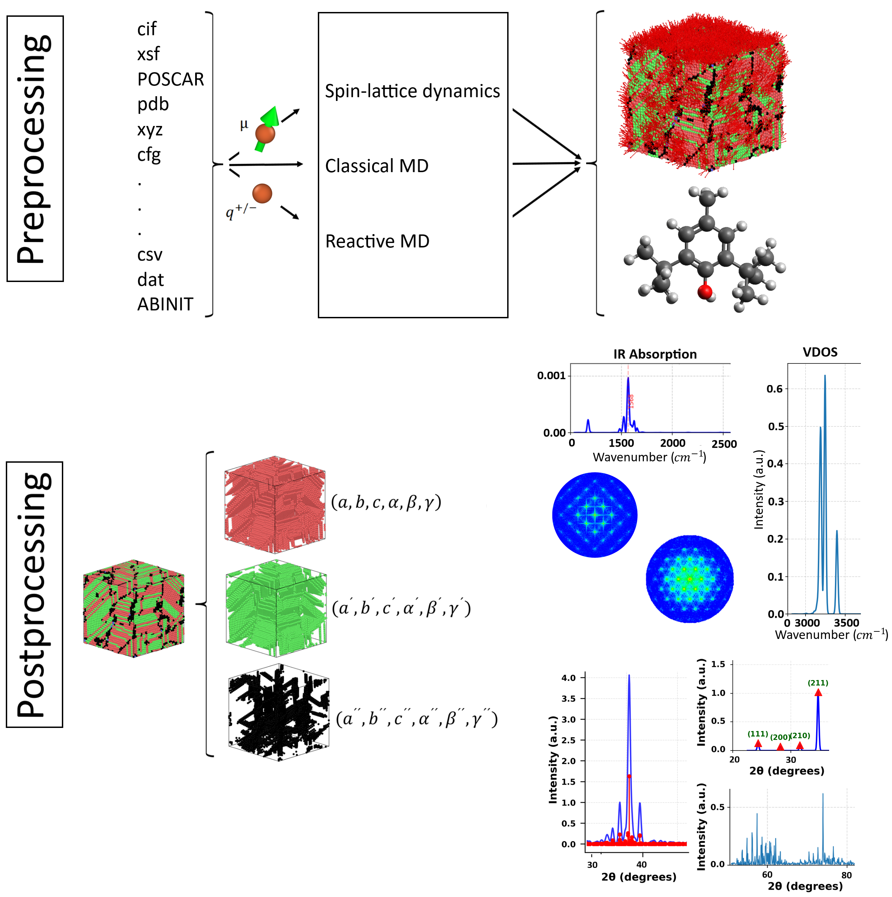

# Virtual Characterization Lab (VCL)

The **Virtual Characterization Lab (VCL)** is an open-source toolkit for **virtual materials characterization**, designed to connect high-fidelity simulations—primarily Molecular Dynamics (MD)—with established experimental techniques. It provides an integrated, GUI-based environment that streamlines the entire workflow from structure preparation to the generation of virtual experimental data.

VCL focuses on:

- **Pre-processing**: preparing structures and input files for classical MD, reactive MD (RMD), and spin-lattice dynamics (SLD)
- **Crystallographic and structural analysis**: analyzing crystal structures, defects, and structural evolution from simulations
- **Virtual characterization**: computing XRD, SAED, VDOS, and IR spectra that are directly comparable to experimental measurements

By unifying these steps in a single framework, VCL reduces the need for multiple disconnected tools and formats, thereby accelerating materials discovery and improving the comparability between computational and experimental data.

---

## Key Capabilities

- **Unified GUI workflow** for pre-processing, analysis, and post-processing
- **Crystallographic analysis** of structures and trajectories
- **Virtual diffraction and spectroscopy**:
    - X-ray Diffraction (XRD)
    - Selected Area Electron Diffraction (SAED)
    - Vibrational Density of States (VDOS)
    - Infrared (IR) spectra
- **MD-centric design**, but applicable beyond MD, supporting flexible system sizes, boundary conditions, and extended methods such as RMD and SLD
- **Direct comparison to experiment**, enabling validation of structures, screening of candidate materials, and generation of training data for machine-learning models

---

## Documentation Structure

The documentation for VCL is organized into the following main components:

- **[Input Converter](Input_Converter_Docs.md)**  
  Tools and workflows for converting structures and simulation outputs into VCL-compatible formats and for setting up inputs for different simulation engines and methods.

- **[Structure Analyzer](Structure_Analyzer_Docs.md)**  
  Functionality for structural and crystallographic analysis, including symmetry, defects, and time-dependent structural evolution.

- **[SAED](SAED_Docs.md)**  
  Methods and settings for computing Selected Area Electron Diffraction (SAED) patterns from simulated structures and trajectories, and strategies for comparison with experimental TEM data.

- **[Vibrational Analysis](Vibrational_Analysis_Docs.md)**  
  Computation and analysis of vibrational properties, including Vibrational Density of States (VDOS) and IR spectra derived from MD simulations.

- **[XRD](XRD_Docs.md)**  
  Generation and analysis of X-ray Diffraction patterns, including configuration of scattering geometries and routines for comparing simulated and experimental XRD data.

---

VCL aims to make virtual characterization **efficient, accessible, and directly comparable to experiment**, enabling researchers to narrow experimental search spaces, validate new materials, and support data-driven approaches in materials science.